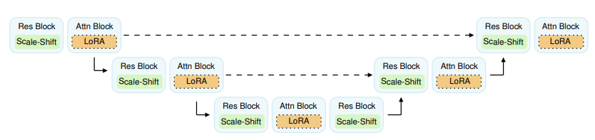

# Simple Drop-in LoRA Conditioning on Attention Layers Will Improve Your Diffusion Model

This is an repository for [Simple Drop-in LoRA Conditioning on Attention Layers Will Improve Your Diffusion Model](https://openreview.net/forum?id=38P40gJPrI).

<p align="center">


The codebase is mainly based on [EDM](https://github.com/NVlabs/edm). 

## Environment

You can install the necessary packages using `conda`. Python 3.9.18 was used in our experiment.

```
conda env create -f environment.yml -n edm
```

## Dataset

Refer to [Preparing datasets](https://github.com/NVlabs/edm?tab=readme-ov-file#preparing-datasets) from EDM repository.

## Training 

Run the following commands to finetune a pretrained diffusion model with LoRA conditioning attached:

**CIFAR10**

```
LORA_FLAGS="--addlora=True --lorarank=4 --numbasis=18 --wmlp=128,64 --finetune=False --base_from_ckpt=True --baseckpt=/path/to/ckpt"


torchrun --standalone --nproc_per_node=4 train.py --outdir=exp --cond=0 --arch=ddpmpp --batch=512 --dump=100 --duration=100 --data=datasets/cifar10-32x32.zip $LORA_FLAGS --cond=0
```

**FFHQ**
```
LORA_FLAGS="--addlora=True --lorarank=4 --numbasis=20 --wmlp=128,64 --finetune=False --base_from_ckpt=True --baseckpt=/path/to/ckpt"

torchrun --standalone --nproc_per_node=8 train.py --outdir=exp --cond=0 --arch=ddpmpp --batch=256 --dump=100 --duration=100 --data=datasets/ffhq-64x64.zip --cres=1,2,2,2 --lr=2e-4 --dropout=0.05 --augment=0.15 $LORA_FLAGS
```


## Generating and Calculating FID

You can generate images from all the checkpoints stored during training using following command:

**CIFAR10**
```
MODEL_FLAGS="--data_dir=/cifar10/exp/directory"
SAMPLING_FLAGS="--seeds=0-49999 --batch=512 --steps 18"
NUM_GPUS=4

torchrun --standalone --nproc_per_node=$NUM_GPUS generate_all.py $MODEL_FLAGS $SAMPLING_FLAGS
```

**FFHQ**
```
MODEL_FLAGS="--data_dir=/ffhq/exp/directory"
SAMPLING_FLAGS="--seeds=0-69999 --batch=256 --steps 40"
NUM_GPUS=8

torchrun --standalone --nproc_per_node=$NUM_GPUS generate_all.py $MODEL_FLAGS $SAMPLING_FLAGS
```

Then you can calculate FID scores of all generated images using following command:

**CIFAR10**
```
torchrun --standalone --nproc_per_node=1 fid_all.py --images=/cifar10/exp/directory --ref=https://nvlabs-fi-cdn.nvidia.com/edm/fid-refs/cifar10-32x32.npz
```

**FFHQ**
```
torchrun --standalone --nproc_per_node=1 fid_all.py --num=70000 --images=/ffhq/exp/directory --ref=https://nvlabs-fi-cdn.nvidia.com/edm/fid-refs/ffhq-64x64.npz
```


## Checkpoints

- CIFAR10 (uncond): [checkpoint]()
- FFHQ : [checkpoint]()

## Citation
 ```
@article{choi2024simpledropinloraconditioning,
      title={Simple Drop-in LoRA Conditioning on Attention Layers Will Improve Your Diffusion Model}, 
      author={Joo Young Choi and Jaesung R. Park and Inkyu Park and Jaewoong Cho and Albert No and Ernest K. Ryu},
      year={2024},
      journal={Transactions on Machine Learning Researche}
}
```

